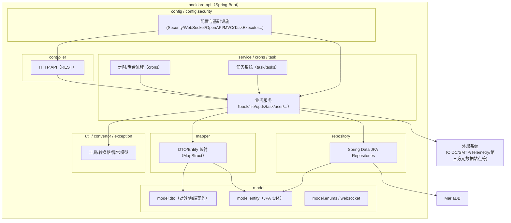
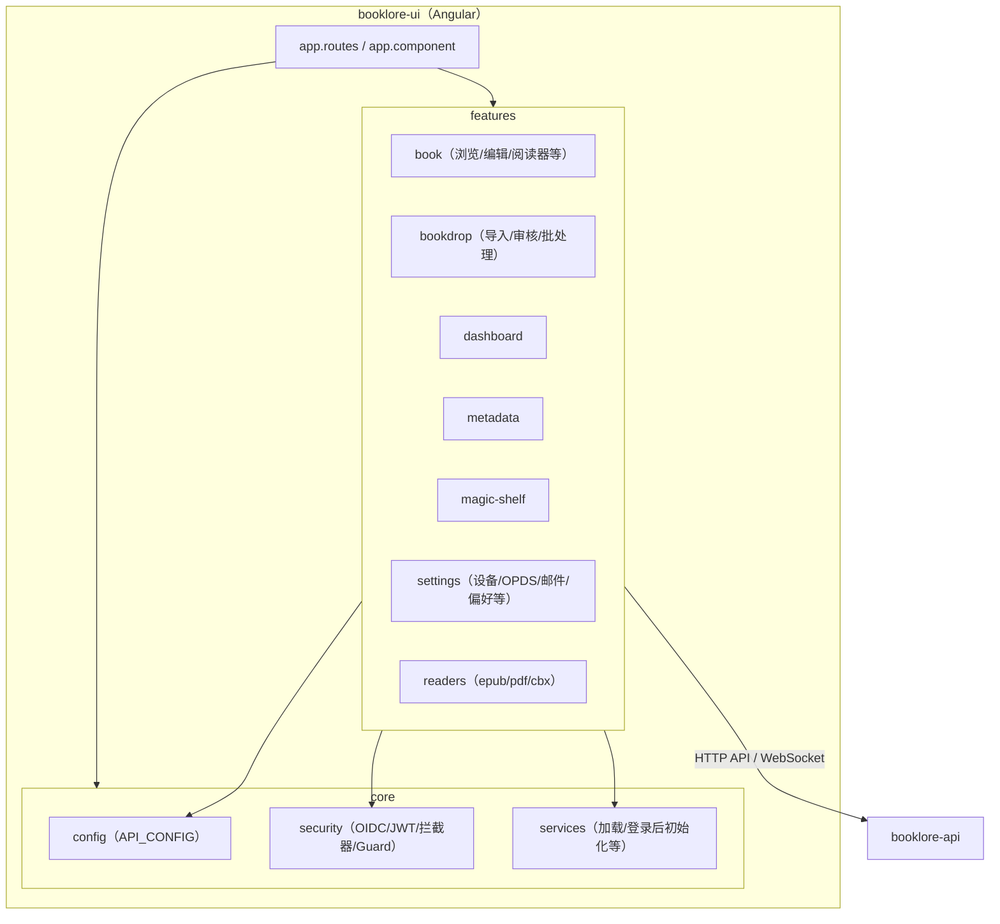

# 架构概览（基于模块依赖与包结构）

## 模块依赖（部署/容器视角）

```mermaid
flowchart LR
  subgraph Browser["浏览器"]
    UI["BookLore UI（Angular）"]
  end

  subgraph Container["单容器（Dockerfile 组合构建）"]
    Nginx["Nginx（静态资源 + 反向代理）"]
    API["BookLore API（Spring Boot）"]
  end

  DB["MariaDB（JPA/Hibernate）"]
  Flyway["Flyway（DB Migration）"]
  Telemetry["Telemetry 服务"]
  OIDC["OIDC Provider（OAuth2/OIDC）"]
  SMTP["SMTP（邮件）"]

  UI -->|HTTP(S) /| Nginx
  Nginx -->|静态文件| UI
  Nginx -->|REST /api/*| API
  Nginx -->|WebSocket /ws| API

  API -->|JPA| DB
  API --> Flyway
  API --> Telemetry
  API --> OIDC
  API --> SMTP
```

## booklore-api 包结构（com.adityachandel.booklore）



## booklore-ui 包结构（src/app）



